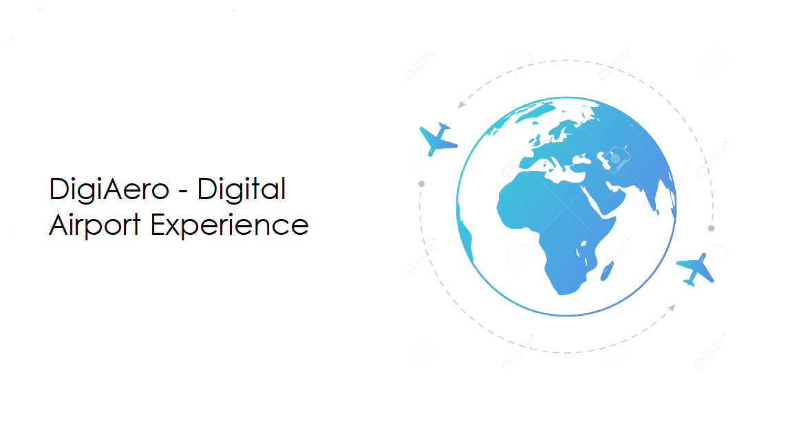

## To access code for APIs that are on the branch "landing_page_photo_dashboard" [Click Here](https://github.com/bhatiagagan24/Jack-The-Hack-Hackathon-/tree/landing_page_photo_dashboard/landing_page_dashboard/back_end)

# DigiAero - Digital Airport Experience
- TechStack
    - Programming languages used: **Dart, Python**
    - **Flutter and Dart** for App Development
    - APIs made in **Flask Framework and Python**
    - Database: **SQLlite** 
    - Google Sign In: **GCP OAuth Service**

-The structure of files
```
lib
|-- API
|------- google_signin_api.dart
|-- SupportClasses
|   |-- Deal.dart
|   |-- DealCard.dart
|   |-- FoodCard.dart
|   |-- PaymentCard.dart
|   `-- past_trip_card.dart
|-- generated_plugin_registrant.dart
|-- main.dart
`-- screens
    |-- appLandingPage.dart : Home Screen of the App
    |-- app_about_us.dart : About the App Description
    |-- app_airport_select.dart : Selection of Airport 
    |-- app_assistance.dart : Screen to request for Wheel Chair
    |-- app_deals.dart : Screen to check the available deals at the airport
    |-- app_flight_details.dart : Form to add a new flight trip
    |-- app_food_load.dart : Lounge's Available Food Items
    |-- app_help.dart : Helpline Services available from App
    |-- app_help_signed_in.dart : Helpline Services available at Airport
    |-- app_login.dart : Google Sign In
    |-- app_lounge_dashboard.dart : Lounge Home Screen
    |-- app_loungea.dart : Screen to choose the lounge
    |-- app_payment.dart : Available Payment Options
    |-- app_payment_add.dart : Add payment
    |-- app_qrcodescanner.dart : QR Code Scanner 
    |-- past_trips 
    |   `-- cards_past_trip.dart : Past Trip Screen
    `-- signed_in_home_screen.dart : Signed In Page
```
- <strong> <em> Need for the App </em> </strong> <br>
Imagine a world where users can access every airport service right from their Phone? Imagine the satisfaction that the flyers will get from this service? Imagine the business   it will generate for the outlets on the airport? Seems too cool right? The current problems that the flyers face right now, is that there is no unified source of information   about the activities on a airport. Requesting a service has also been a tedious task on an airport. Further, there is no lack of activities and consumer shops on the airport,  yet flyers prefer to seat themselves at a single spot before a flight, which further hurts the business interests of the shop owners.

<p align="center"> <strong> Flyers should have the power to improve their airport experience in their own hands !! </strong> </p>

<!-- 
- <strong> Description of the App </strong>
    - Cross Platform App built in Flutter.
    - 

- 

 -->

# Jack-The-Hack-Hackathon-
